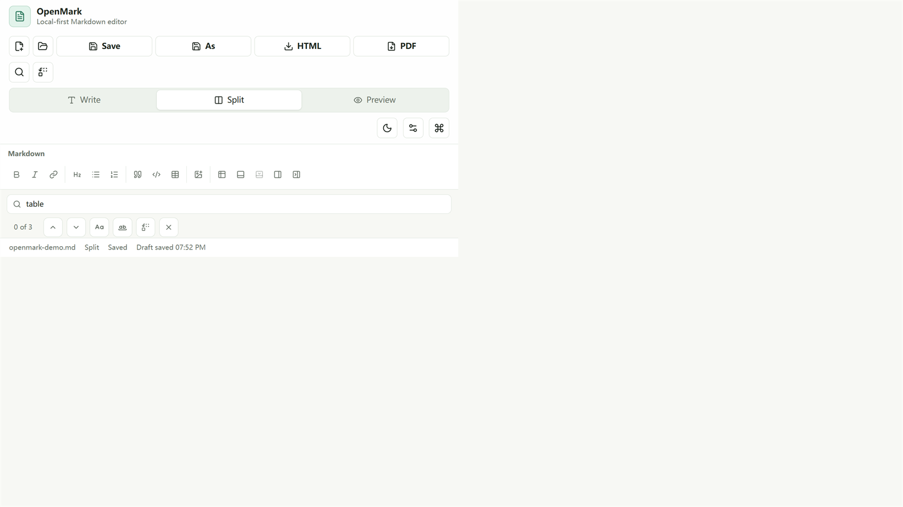
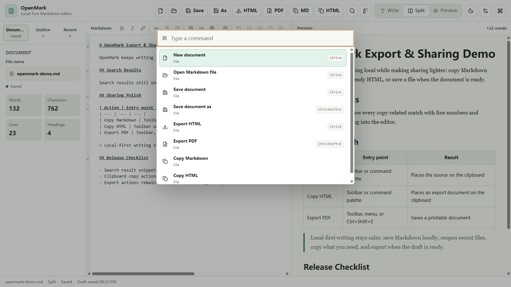
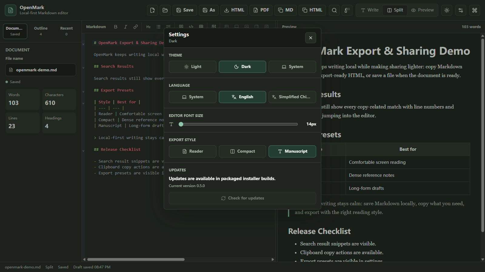

# OpenMark

<p>
  <a href="#english">English</a> · <a href="#zh-cn">简体中文</a>
</p>

[](https://github.com/CyrusAuyeung/OpenMark/actions/workflows/ci.yml)
[](https://github.com/CyrusAuyeung/OpenMark/actions/workflows/release.yml)
[](https://github.com/CyrusAuyeung/OpenMark/releases/tag/v0.20.0)
[](LICENSE)
[](docs/download.md)

<a id="english"></a>

## English

OpenMark is a local-first Markdown editor for people who want a calm desktop writing tool without turning their notes into a full knowledge-management system. It keeps the core loop focused: write Markdown, preview safely, save locally, reopen recent files, and export when a document is ready to share.



### Why OpenMark

- Local-first by default: your Markdown files stay on your machine.
- Editor-first interface: no marketing shell, no account flow, no workspace lock-in.
- Practical desktop features: native open/save dialogs, recent files, HTML/PDF export, and update checks.
- Safe preview pipeline: Markdown is rendered with `markdown-it` and sanitized with `DOMPurify`.
- Small roadmap, steady polish: OpenMark favors reliable editor improvements over broad feature bundles.

### Demo

See [Demo Assets](docs/demo.md) for the screenshot gallery, video script, and capture checklist. README screenshots are shown at full width so the editor, preview, toolbar, and dialogs remain readable on GitHub.

#### Command Palette



The command palette keeps OpenMark keyboard-first: create and open documents, save, copy, or export, find and replace, insert images and tables, switch view modes, jump between sidebar panels, adjust appearance, and check for updates.

#### Appearance Settings



Appearance settings cover light, dark, and system themes, language preference, editor font size, export style presets, and packaged-app update checks without leaving the writing workspace.

### Download

The latest desktop release is available on the [GitHub Releases page](https://github.com/CyrusAuyeung/OpenMark/releases/latest). See the [Download Guide](docs/download.md) for platform-specific guidance.

| Platform | Package |
| --- | --- |
| Windows installer | `OpenMark.Setup.0.20.0.exe` |
| Windows portable app | `OpenMark.0.20.0.exe` |
| macOS Intel | `OpenMark-0.20.0.dmg` |
| macOS Apple Silicon | `OpenMark-0.20.0-arm64.dmg` |
| Linux Debian/Ubuntu | `openmark-editor_0.20.0_amd64.deb` |

Windows and macOS builds are currently unsigned, so the first launch may show operating-system warnings. Signed Windows releases are supported once code-signing secrets are configured in GitHub Actions; see [Windows Code Signing](docs/windows-signing.md).

### Features

- CodeMirror Markdown editing with write, split, and preview modes
- Resizable editor/preview panes with saved split balance
- Command palette for file, edit, view, workspace, export, and update actions
- Markdown toolbar for bold, italic, links, images, headings, lists, task lists, dividers, quotes, code blocks, and tables
- Smart Markdown editing helpers for list continuation, task checkbox toggling, URL paste-to-link, and plain-text paste cleanup
- Find and replace with match case, whole word, focused result feedback, click-to-jump navigation, replace next, and replace all
- Go to Line, filtered document outline, preview heading jumps, position indicators, and split-view editor/preview scroll synchronization
- Lightweight document diagnostics for broken links, missing local images, and absolute image paths with click-to-jump issue navigation
- Markdown table insertion, selected text-to-table conversion, and contextual row/column editing controls
- Local image insertion with desktop `assets/` copying, portable relative paths, and one-click repair for absolute local image references
- Export preview, HTML/PDF export, and Markdown/HTML clipboard copy from the toolbar, command palette, and in-app desktop menu
- Reader, compact, and manuscript export style presets shared by HTML export, PDF export, and Copy HTML
- Share-friendly export metadata with derived document titles, descriptions, Open Graph, and Twitter summary tags
- Document outline, stats, editable file name, recent files, recovery snapshots, and unsaved-change protection
- Searchable recent files, workspace folder browsing, unified quick open, and keyboard-friendly library lists
- Light, dark, and system theme preferences with adjustable editor font size
- English and Simplified Chinese UI language preferences
- Electron desktop shell with native open/save dialogs, a styled File/Edit/View/Help menu, update checks, and external-change save warnings

### Run From Source

Install dependencies and start the browser version:

```bash
npm install
npm run dev
```

Run the desktop shell during development:

```bash
npm run desktop:dev
```

Rust is not required for the current desktop milestone. OpenMark uses a lightweight Electron shell until the project is ready to evaluate Tauri.

If Electron downloads slowly, set a mirror before the first desktop run:

```powershell
$env:ELECTRON_MIRROR="https://npmmirror.com/mirrors/electron/"
npm run desktop:dev
```

### Shortcuts

Useful desktop shortcuts:

- `Ctrl+N`: new document
- `Ctrl+O`: open Markdown file
- `Ctrl+S`: save current Markdown file
- `Ctrl+Shift+S`: save as
- `Ctrl+E`: export HTML
- `Ctrl+Shift+E`: export PDF
- Preview the export document from the toolbar, command palette, or in-app File menu
- Copy Markdown or HTML from the toolbar, command palette, or in-app Edit menu
- `Ctrl+F`: find in the current document
- `Ctrl+H`: replace in the current document
- `Ctrl+P`: quick open workspace and recent files
- `Ctrl+Shift+P`: open the command palette
- `Ctrl+1`, `Ctrl+2`, `Ctrl+3`: write, split, and preview modes
- `Ctrl+Shift+L`: toggle theme
- `Ctrl+,`: open appearance settings

Useful editor shortcuts:

- `Ctrl+B`: wrap selection in bold Markdown
- `Ctrl+I`: wrap selection in italic Markdown
- `Ctrl+K`: insert a Markdown link
- `Ctrl+Shift+X`: toggle the current task checkbox

### Quality And Packaging

```bash
npm run lint
npm run build
```

```bash
npm run package
npm run dist:win
npm run dist:mac
npm run dist:linux
```

Release files are written to `release/`. Run platform distribution scripts on their matching operating systems.

Packaged installer builds can check GitHub Releases from **Help > Check for Updates...** or **Settings > Updates**. Linux AppImage support is planned after the `.deb` release path is stable.

See [Release Guide](docs/release.md) for local packaging and GitHub release steps.

### Roadmap Direction

OpenMark should stay simple before it becomes powerful. The near-term goal is a reliable editor core and native desktop shell. Upcoming product work focuses on document search, stronger preview/editor navigation, export polish, and cross-platform distribution quality.

### Documentation

- [Architecture](docs/architecture.md)
- [Roadmap](docs/roadmap.md)
- [Download Guide](docs/download.md)
- [Demo Assets](docs/demo.md)
- [Plugin API Design](docs/plugin-api.md)
- [Localization](docs/localization.md)
- [Windows Code Signing](docs/windows-signing.md)
- [Contributing](docs/contributing.md)
- [Release Guide](docs/release.md)
- [Changelog](CHANGELOG.md)

### Community

- Report bugs through [GitHub Issues](https://github.com/CyrusAuyeung/OpenMark/issues/new?template=bug_report.yml).
- Suggest focused features with the [feature request form](https://github.com/CyrusAuyeung/OpenMark/issues/new?template=feature_request.yml).
- Open pull requests with `npm run lint` and `npm run build` results.
- Read the [Security Policy](SECURITY.md) before reporting vulnerabilities.

### License

MIT

<a id="zh-cn"></a>

## 简体中文

OpenMark 是一个本地优先的 Markdown 编辑器，面向希望拥有安静、可靠桌面写作工具的用户。它不把笔记强行变成复杂知识库，而是把核心写作闭环做好：编写 Markdown、安全预览、本地保存、重新打开最近文件，并在需要时导出分享。


### 为什么选择 OpenMark

- 默认本地优先：Markdown 文件保存在你的电脑上。
- 以编辑器为中心：没有营销页、账号流程或平台锁定。
- 实用桌面能力：原生打开/保存、最近文件、HTML/PDF 导出和更新检查。
- 安全预览链路：使用 `markdown-it` 渲染 Markdown，并通过 `DOMPurify` 清理 HTML。
- 小步稳定迭代：优先打磨可靠编辑体验，而不是一次塞进庞大功能包。

### 演示

查看 [Demo Assets](docs/demo.md) 获取截图图库、短视频脚本和截图检查清单。README 中的截图采用全宽展示，确保在 GitHub 页面中依然能看清编辑器、预览区、工具栏和弹窗。

#### 命令面板


命令面板让 OpenMark 更适合键盘操作：新建和打开文档、保存、复制或导出、查找替换、插入图片和表格、切换视图、切换侧栏、调整外观，以及检查更新。

#### 外观设置


外观设置支持浅色、深色和跟随系统主题，语言偏好、编辑器字号、导出样式预设，以及打包应用的更新检查。所有设置都在写作工作区内完成。

### 下载

最新桌面版本可在 [GitHub Releases 页面](https://github.com/CyrusAuyeung/OpenMark/releases/latest) 下载。平台选择说明见 [下载指南](docs/download.md)。

| 平台 | 安装包 |
| --- | --- |
| Windows 安装版 | `OpenMark.Setup.0.20.0.exe` |
| Windows 便携版 | `OpenMark.0.20.0.exe` |
| macOS Intel | `OpenMark-0.20.0.dmg` |
| macOS Apple Silicon | `OpenMark-0.20.0-arm64.dmg` |
| Linux Debian/Ubuntu | `openmark-editor_0.20.0_amd64.deb` |

Windows 和 macOS 构建当前尚未签名，首次启动可能出现系统安全提示。配置 GitHub Actions 签名密钥后可发布已签名 Windows 版本，流程见 [Windows Code Signing](docs/windows-signing.md)。

### 功能

- 基于 CodeMirror 的 Markdown 编辑体验，支持编写、分屏和预览模式
- 可调整的编辑器/预览分栏，并记住分栏比例
- 命令面板覆盖文件、编辑、视图、工作区、导出和更新操作
- Markdown 工具栏支持粗体、斜体、链接、图片、标题、列表、任务列表、分隔线、引用、代码块和表格
- Markdown 编辑助手支持列表续行、任务复选框切换、粘贴 URL 生成链接，以及纯文本粘贴清理
- 查找替换支持大小写匹配、全词匹配、聚焦结果反馈、点击跳转、替换当前项和全部替换
- 跳转到行、可筛选文档大纲、预览标题回跳、位置指示器，以及分屏编辑器/预览滚动同步
- 轻量文档诊断可发现坏链接、缺失本地图片和绝对图片路径，并支持点击跳转到问题行
- 插入 Markdown 表格，将选中文本转换为表格，并在表格内使用行/列编辑控件
- 插入本地图片时可复制到文档 `assets/` 文件夹，使用可移植相对路径，并支持一键修复绝对本地图片引用
- 通过工具栏、命令面板和应用内桌面菜单预览导出文档、导出 HTML/PDF，或复制 Markdown/HTML 到剪贴板
- 阅读、紧凑和文稿导出样式预设，供 HTML 导出、PDF 导出和复制 HTML 共用
- 分享友好的导出元数据，会从文档标题和正文生成标题、描述、Open Graph 和 Twitter 摘要标签
- 文档大纲、统计信息、可编辑文件名、最近文件和未保存保护
- 可搜索最近文件、浏览本地工作区文件夹、统一快速打开，以及适合键盘操作的文件库列表
- 浅色、深色、跟随系统主题，以及可调整编辑器字号
- 英文和简体中文界面语言偏好
- Electron 桌面外壳，支持原生打开/保存对话框、统一风格的文件/编辑/视图/帮助菜单、更新检查和外部变更保存警告

### 从源码运行

安装依赖并启动浏览器版本：

```bash
npm install
npm run dev
```

开发时启动桌面外壳：

```bash
npm run desktop:dev
```

当前桌面阶段不需要 Rust。OpenMark 目前使用轻量 Electron 外壳，等项目准备好后再评估 Tauri。

如果 Electron 下载较慢，可以在首次桌面运行前设置镜像：

```powershell
$env:ELECTRON_MIRROR="https://npmmirror.com/mirrors/electron/"
npm run desktop:dev
```

### 快捷键

常用桌面快捷键：

- `Ctrl+N`：新建文档
- `Ctrl+O`：打开 Markdown 文件
- `Ctrl+S`：保存当前 Markdown 文件
- `Ctrl+Shift+S`：另存为
- `Ctrl+E`：导出 HTML
- `Ctrl+Shift+E`：导出 PDF
- 可通过工具栏、命令面板或应用内文件菜单预览导出文档
- 可通过工具栏、命令面板或应用内编辑菜单复制 Markdown 或 HTML
- `Ctrl+F`：在当前文档中查找
- `Ctrl+H`：在当前文档中替换
- `Ctrl+P`：快速打开工作区和最近文件
- `Ctrl+Shift+P`：打开命令面板
- `Ctrl+1`、`Ctrl+2`、`Ctrl+3`：编写、分屏和预览模式
- `Ctrl+Shift+L`：切换主题
- `Ctrl+,`：打开外观设置

常用编辑器快捷键：

- `Ctrl+B`：将选中文本包裹为 Markdown 粗体
- `Ctrl+I`：将选中文本包裹为 Markdown 斜体
- `Ctrl+K`：插入 Markdown 链接
- `Ctrl+Shift+X`：切换当前任务复选框

### 质量检查与打包

```bash
npm run lint
npm run build
```

```bash
npm run package
npm run dist:win
npm run dist:mac
npm run dist:linux
```

发布文件会写入 `release/`。平台分发脚本应在对应操作系统上运行。

打包后的安装器版本可通过 **帮助 > 检查更新** 或 **设置 > 更新** 检查 GitHub Releases 更新。Linux AppImage 支持会在 `.deb` 发布路径稳定后继续推进。

本地打包和 GitHub 发布流程见 [Release Guide](docs/release.md)。

### 路线方向

OpenMark 会先保持简单，再逐步变强。近期目标是可靠编辑器核心和原生桌面外壳；后续重点包括文档搜索、更强的预览/编辑联动、导出质量打磨和跨平台分发体验。

### 文档

- [架构](docs/architecture.md)
- [路线图](docs/roadmap.md)
- [下载指南](docs/download.md)
- [演示资产](docs/demo.md)
- [插件 API 设计](docs/plugin-api.md)
- [本地化](docs/localization.md)
- [Windows 代码签名](docs/windows-signing.md)
- [贡献指南](docs/contributing.md)
- [发布指南](docs/release.md)
- [更新日志](CHANGELOG.md)

### 社区

- 通过 [GitHub Issues](https://github.com/CyrusAuyeung/OpenMark/issues/new?template=bug_report.yml) 报告问题。
- 通过 [功能建议表单](https://github.com/CyrusAuyeung/OpenMark/issues/new?template=feature_request.yml) 提出聚焦的功能建议。
- 提交 PR 时请附上 `npm run lint` 和 `npm run build` 的结果。
- 报告安全问题前请阅读 [Security Policy](SECURITY.md)。

### 许可证

MIT
